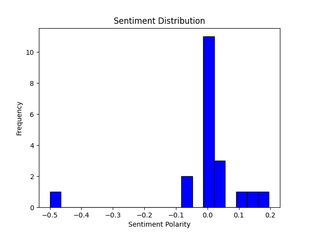

This repository includes scripts for analyzing news articles, organized as follows:

- `fetch_data.py`: Retrieves news articles from an API and saves them as JSON.
- `preprocess.py`: Cleans and normalizes text data of fetched news articles.
- `sentiment.py`: Analyzes sentiment of preprocessed news articles and adds sentiment scores.
- `topic_modeling.py`: Uses Latent Dirichlet Allocation (LDA) for topic modeling on preprocessed news articles.
- `visualize.py`: Visualizes results from sentiment analysis and topic modeling.

The `analysis.py` script coordinates the entire pipeline: fetching articles, preprocessing, sentiment analysis, topic modeling, and visualization.

**Usage:**
Execute `analysis.py` to run the entire analysis pipeline, including fetching articles, preprocessing, sentiment analysis, topic modeling, and visualization.

**Dependencies:**
Ensure the following dependencies are installed:
- `requests` for API requests
- `json` for JSON data parsing
- `spacy` for natural language processing
- `gensim` for topic modeling
- `matplotlib` for visualization

